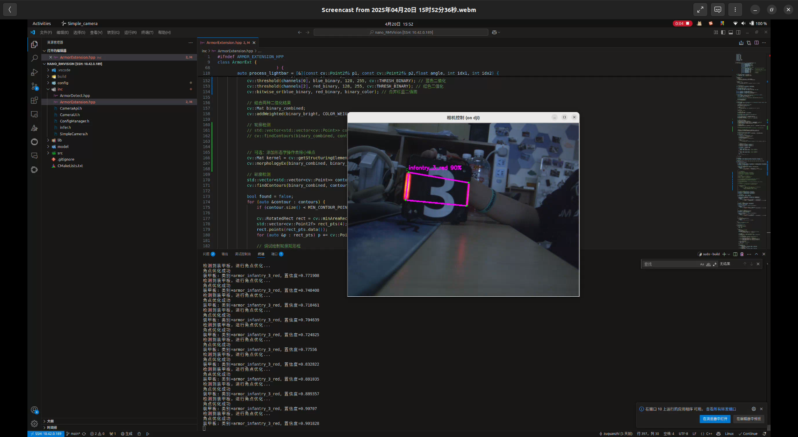

# nano_RMVision

## 🚀 项目简介
nano_RMVision 是一款高性能、轻量级的机器人视觉系统，专为 RoboMaster 比赛设计。它结合了工业相机 SDK、OpenCV 图像处理和 OpenVINO 深度学习推理技术，提供了实时装甲板检测与识别功能。系统采用模块化设计，支持多种运行模式和环境适配，是机器人视觉解决方案的理想选择。


## ✨ 核心功能
- **高性能工业相机接入**：集成工业相机 SDK，支持高帧率图像采集
- **装甲板实时检测**：基于 OpenVINO 的深度学习模型推理，实现精准装甲板检测
- **装甲板角点优化**：先进的角点优化算法，提升装甲板定位精度
- **可配置参数系统**：丰富的配置选项，支持参数实时调整和持久化
- **友好的图形界面**：交互式 GUI 界面，方便调试和操作
- **多环境适配**：支持 GUI 和无头模式，适应不同运行环境
- **高效的 X11 远程显示支持**：针对 SSH 远程连接场景优化

## 📋 系统要求

### 操作系统
- Ubuntu 18.04+/20.04 LTS

### 依赖库
- OpenCV 4.x+
- OpenVINO 2021.4+
- 工业相机 SDK (MVSDK)

### 硬件需求
- 支持 OpenVINO 的 CPU 或 GPU
- 兼容的工业相机设备
- 至少 4GB 内存

## 🛠️ 安装指南

1. 克隆仓库
   ```bash
   git clone https://github.com/username/nano_RMVision.git
   cd nano_RMVision
   ```

2. 安装依赖
   ```bash
   ./install_dependencies.sh
   ```

3. 编译项目
   ```bash
   mkdir build && cd build
   cmake ..
   make -j$(nproc)
   ```

## 📝 使用说明

### 命令行选项

| 选项 | 描述 |
|------|------|
| `--help`, `-h` | 显示帮助信息 |
| `--no-gui`, `-n` | 无 GUI 模式运行，仅相机捕获 |
| `--headless` | 无 GUI 模式运行，与 `--no-gui` 相同 |
| `--display-env` | 显示 DISPLAY 环境变量设置 |
| `--force-x11` | 强制使用 X11 后端显示 |
| `--fix-black` | 启用黑框修复模式 |

### 配置文件
系统使用 YAML 配置文件存储相机参数和装甲板检测设置：

```yaml
camera:
  exposure: 5000
  gain: 10
  fps: 120
  
armor_detect:
  threshold: 0.6
  nms_threshold: 0.3
  roi_expand: 1.5
```

### 键盘快捷键
在 GUI 模式下，可使用以下快捷键：

| 按键 | 功能 |
|------|------|
| S | 保存当前配置 |
| R | 刷新显示（解决远程连接黑框问题） |
| ESC | 退出程序 |

## 📊 技术架构
架构图

## 🔍 功能详解
### 装甲板检测
系统使用 OpenVINO 加载并运行深度学习模型，检测图像中的装甲板。检测过程包括:

- 图像预处理（缩放、填充）
- 模型推理
- 装甲板筛选（置信度、NMS）
- 角点优化（可选）
- 结果可视化

装甲板检测过程

### 角点优化算法
为提高装甲板定位精度，系统实现了角点优化算法:

- ROI 区域自适应扩展
- 灯条轮廓提取与分析
- 亮度与颜色权重自适应
- 装甲板几何验证

以下参数可调整优化效果:

- ROI_EXPAND_RATIO: ROI 扩展比例
- LENGTH_EXTEND_FACTOR: 灯条扩展系数
- MIN_CONTOUR_POINTS: 最小轮廓点数

更多参数详见配置文件...

## 💻 开发指南
### 添加新装甲板类型
- 修改 ArmorDetect.hpp 中的 CLASS_NAMES 数组
- 训练并更新模型文件
- 根据需要调整特定装甲板的显示参数

### 扩展相机支持
- 在 SimpleCamera.h 中添加新相机类型接口
- 实现相应的相机初始化和帧获取函数
- 更新配置文件结构

## 🔄 常见问题
### 远程连接显示问题
如出现黑框或显示异常:

- 使用 --fix-black 参数启动
- 尝试 ssh -Y 替代 ssh -X
- 在主机上设置 export XLIB_SKIP_ARGB_VISUALS=1

### 相机连接失败
- 检查相机连接和权限
- 验证驱动是否正确安装
- 执行 sudo usermod -aG video $USER 并重新登录

## 📝 许可证
本项目基于 MIT License 开源。

## 📺 演示图片


提示: 如果您在项目中使用了 nano_RMVision，请考虑在您的项目中引用本项目。


<!-- <p align="center">  <br> <small>nano_RMVision © 2025</small> </p> -->
